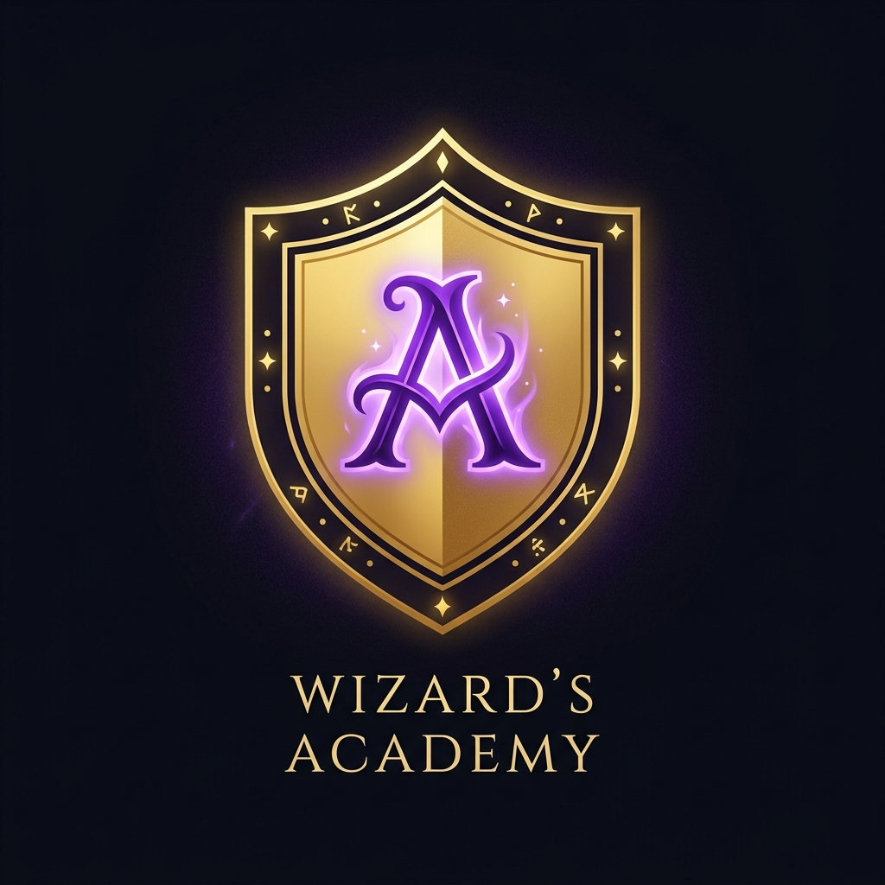

<div align="center">
  
  <h1>✨ Wizard's Academy ✨</h1>
  
  <h3><a href="https://play-wizards-academy.up.railway.app/">🎮 Play the Game Live Here! 🎮</a></h3>
  
  <p>
    
    
    
    
    
    
  </p>

  <p><i>A magical web application featuring immersive mini-games, an RPG progression system, and an enchanting user experience!</i></p>
</div>

---

## 🔮 Overview

**Wizard's Academy** is a single-page web application built to bring the magic of a wizarding school right to your browser. You can enroll in the academy, get sorted into a magical house, play various interactive mini-games, earn Galleons and XP, and level up your character!

The project emphasizes a rich, dynamic design featuring glassmorphism, magical micro-animations, particle effects, and ambient audio to create a truly premium experience.

---

## ✨ Features

🏰 **Immersive Hub**: Navigate through a stunning 3D-styled Hogwarts map to discover different classes and locations.
🧙 **RPG Progression**: Earn XP to level up your wizard, and collect Galleons to purchase magical items, pets, and wands from Diagon Alley.
🏆 **Global Leaderboard**: Compete with other wizards and witches to see who is the most powerful in the academy.
🎩 **Sorting Ceremony**: Discover your true house in an interactive, animated sorting ceremony.

### 🎮 Magical Mini-Games
- **Spell Casting**: Master ancient incantations and trace wand movements.
- **Potion Mixing**: Combine the right magical ingredients in your cauldron.
- **Divination**: Gaze into the Crystal Ball to reveal your daily fortune.
- **Care of Magical Creatures**: Earn the trust of magical beasts like Hippogriffs and Nifflers.
- **Herbology**: Pot Mandrakes and harvest magical plants.
- **Dueling Club**: Face off against other wizards in magical combat.
- **Flying Challenge**: Mount your broomstick and catch the Golden Snitch!
- **Memory Cards**: Test your wizarding knowledge with magical matching cards.
- **House Quiz**: Answer trivia to earn house points.

⭐ *If you want to know more about all the magical games we have, try the app!*

---

## 📸 Gallery

<details>
<summary><b>Click to view magical screenshots of the academy!</b></summary>
<br>

### The Great Hall (Home)


### The Marauder's Map (Games)


### Student Profile


### Diagon Alley (Shop & Inventory)
.png)

### House Cup Leaderboard


### About The Academy


### Settings & Audio


</details>

---

## 🛠️ Technology Stack

- **Frontend**: HTML5, Vanilla JavaScript, CSS3 (Custom Variables, Flexbox/Grid, Animations)
- **Animation**: [GSAP (GreenSock)](https://greensock.com/) for fluid entrance animations and micro-interactions.
- **Backend**: Node.js, Express.js
- **Architecture**: Single Page Application (SPA) with dynamic view loading and DOM manipulation.

---

## 🚀 Getting Started

To run the Wizard's Academy locally on your own machine, follow these steps:

### Prerequisites
Make sure you have [Node.js](https://nodejs.org/) installed on your computer.

### Installation

1. **Clone or download the repository** to your local machine.
2. **Open a terminal** and navigate to the project directory:
   ```bash
   cd "Wizard's Academy"
   ```
3. **Install the required dependencies** (Express):
   ```bash
   npm install
   ```
4. **Start the magical server**:
   ```bash
   node server.js
   ```
   *Alternatively, if you have a `start` script configured, you can run `npm start`.*
5. **Open your browser** and visit:
   ```text
   http://localhost:3000
   ```

---

## 📁 Project Structure

```text
Wizard's Academy/
├── public/                 # Frontend assets
│   ├── css/                # Stylesheets (Global, Games, Components)
│   ├── js/                 # Logic (Core, RPG Engine, Mini-games)
│   ├── views/              # HTML fragments for the SPA
│   ├── sounds/             # Ambient audio and sound effects
│   ├── images/             # Assets and icons
│   └── index.html          # Main entry point
├── data/                   # JSON databases (Users, Progress)
├── Screenshots/            # Project showcase images
├── server.js               # Node.js Express server
└── package.json            # Dependencies and scripts
```

---

<div align="center">
  <p><i>"Nitwit! Blubber! Oddment! Tweak!"</i></p>
  <b>Mischief Managed.</b>
  <br><br>
  <p>⭐ <b>If you find this project interesting or helpful, please consider giving it a star on GitHub! It helps a lot!</b> ⭐</p>
</div>
